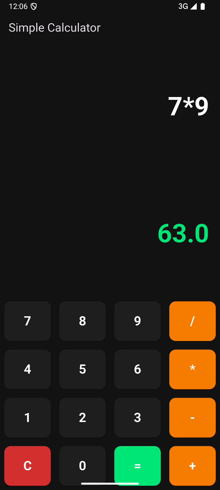

# 🖩 Flutter Calculator App

A simple yet elegant calculator app built with **Flutter**. It supports basic arithmetic operations and features a **modern dark UI**.

## 🚀 Features

✅ Supports **Addition, Subtraction, Multiplication, and Division**\
✅ Modern **Dark-Themed UI**\
✅ Responsive **Button Layout**\
✅ Built with **Flutter & Dart**

## 📸 Screenshots



## 🛠️ Installation

Follow these steps to run the app on your local machine:

1. **Clone the repository**

   ```sh
   git clone https://github.com/Piyush1716/flutter-calculator-app.git
   cd flutter-calculator-app
   ```

2. **Install dependencies**

   ```sh
   flutter pub get
   ```

3. **Run the app**

   ```sh
   flutter run
   ```

## 📦 Build APK

To generate a release APK, use the following command:

```sh
flutter build apk --release
```

This will create an `app-release.apk` in the `build/app/outputs/flutter-apk/` directory.

## 🤝 Contributing

Feel free to fork this repo and contribute!

## 📜 License

This project is **open-source** and available under the MIT License.

